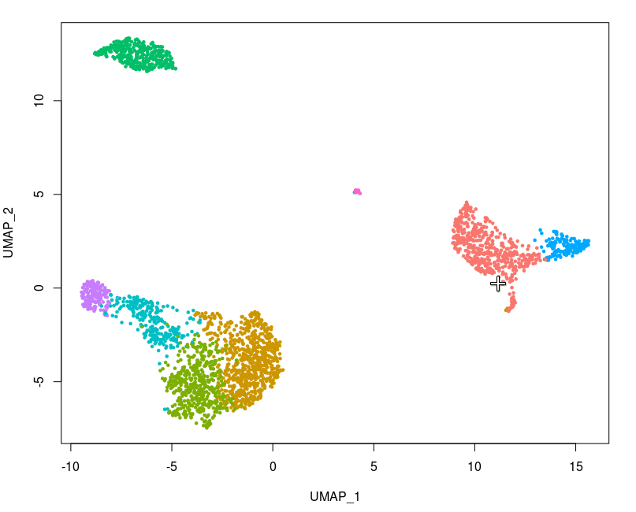

```{r setup, include=FALSE}
all_times <- list()  # store the time for each chunk
knitr::knit_hooks$set(time_it = local({
  now <- NULL
  function(before, options) {
    if (before) {
      now <<- Sys.time()
    } else {
      res <- difftime(Sys.time(), now, units = "secs")
      all_times[[options$label]] <<- res
    }
  }
}))
knitr::opts_chunk$set(
  fig.cap = '',
  fig.width = 9,
  fig.height = 7,
  tidy = TRUE,
  tidy.opts = list(width.cutoff = 95),
  message = FALSE,
  warning = FALSE,
  time_it = TRUE
)
options(SeuratData.repo.use = 'satijalab04.nygenome.org')
```

We'll demonstrate visualization techniques in Seurat using our previously computed Seurat object from the 2,700 PBMC tutorial. You can download this dataset from [SeuratData](https://github.com/satijalab/seurat-data)

```{r data, eval = FALSE}
SeuratData::InstallData('pbmc3k')
```

```{r seed, include=FALSE}
set.seed(seed = 42)
```

```{r initialize_object}
library(Seurat)
library(SeuratData)
library(ggplot2)
library(patchwork)
data("pbmc3k.final")
pbmc3k.final$groups <- sample(c('group1', 'group2'), size = ncol(pbmc3k.final), replace = TRUE)
features <- c("LYZ", "CCL5", "IL32", "PTPRCAP", "FCGR3A", "PF4")
pbmc3k.final
```


# Five visualizations of marker feature expression

```{r visualization_smorgasbord, fig.height=11}
# Ridge plots - from ggridges. Visualize single cell expression distributions in each cluster
RidgePlot(pbmc3k.final, features = features, ncol = 2)

# Violin plot - Visualize single cell expression distributions in each cluster
VlnPlot(pbmc3k.final, features = features)

# Feature plot - visualize feature expression in low-dimensional space
FeaturePlot(pbmc3k.final, features = features)
```

```{r visualization_smorgasbord2, fig.height = 5}
# Dot plots - the size of the dot corresponds to the percentage of cells expressing the feature in each cluster. The color represents the average expression level
DotPlot(pbmc3k.final, features = features) + RotatedAxis()
# Single cell heatmap of feature expression
DoHeatmap(subset(pbmc3k.final, downsample = 100), features = features, size = 3)
```

# New additions to `FeaturePlot`

```{r featureplot}
# Plot a legend to map colors to expression levels
FeaturePlot(pbmc3k.final, features = 'MS4A1')

# Adjust the contrast in the plot
FeaturePlot(pbmc3k.final, features = 'MS4A1', min.cutoff = 1, max.cutoff = 3)
```

```{r featureplot2, fig.height = 4}
# Calculate feature-specific contrast levels based on quantiles of non-zero expression. Particularly useful when plotting multiple markers
FeaturePlot(pbmc3k.final, features = c('MS4A1', "PTPRCAP"), min.cutoff = "q10", max.cutoff = "q90")

# Visualize co-expression of two features simultaneously
FeaturePlot(pbmc3k.final, features = c('MS4A1', 'CD79A'), blend = TRUE)
```

```{r featureplot.split}
# Split visualization to view expression by groups (replaces FeatureHeatmap)
FeaturePlot(pbmc3k.final, features = c('MS4A1', 'CD79A'), split.by = 'groups')
```

# Updated and expanded visualization functions

In addition to changes to `FeaturePlot()`, several other plotting functions have been updated and expanded with new features and taking over the role of now-deprecated functions

```{r new_functions}
# Violin plots can also be split on some variable. Simply add the splitting variable to object metadata and pass it to the split.by argument
VlnPlot(pbmc3k.final, features = 'percent.mt', split.by = 'groups')

# SplitDotPlotGG has been replaced with the `split.by` parameter for DotPlot
DotPlot(pbmc3k.final, features = features, split.by = 'groups') + RotatedAxis()

# DimPlot replaces TSNEPlot, PCAPlot, etc. In addition, it will plot either "umap", "tsne", or "pca" by default, in that order
DimPlot(pbmc3k.final)
pbmc3k.final.no.umap <- pbmc3k.final
pbmc3k.final.no.umap[['umap']] <- NULL
DimPlot(pbmc3k.final.no.umap) + RotatedAxis()
```

```{r new2, fig.width=11, fig.height = 15}
# DoHeatmap now shows a grouping bar, splitting the heatmap into groups or clusters. This can be changed with the `group.by` parameter
DoHeatmap(pbmc3k.final, features = VariableFeatures(pbmc3k.final)[1:100], cells = 1:500, size = 4, angle = 90) + NoLegend()
```

# Applying themes to plots

With Seurat, all plotting functions return ggplot2-based plots by default, allowing one to easily capture and manipulate plots just like any other ggplot2-based plot.

```{r themeing, fig.height=6}
baseplot <- DimPlot(pbmc3k.final, reduction = 'umap')
# Add custom labels and titles
baseplot + labs(title = 'Clustering of 2,700 PBMCs')
# Use community-created themes, overwriting the default Seurat-applied theme
# Install ggmin with remotes::install_github("sjessa/ggmin")
baseplot + ggmin::theme_powerpoint()
# Seurat also provides several built-in themes, such as DarkTheme; for more details see ?SeuratTheme
baseplot + DarkTheme()
# Chain themes together
baseplot + FontSize(x.title = 20, y.title = 20) + NoLegend()
```

```{r save.img, include=FALSE}
library(ggplot2)
plot <- baseplot + DarkTheme() + 
    theme(axis.title = element_text(size = 18), legend.text = element_text(size = 18)) + 
    guides(colour = guide_legend(override.aes = list(size = 10)))
ggsave(filename = "../output/images/visualization_vignette.jpg", height = 7, width = 12, plot = plot, quality = 50)
```

# Interactive plotting features

Seurat utilizes R's plotly graphing library to create interactive plots. This interactive plotting feature works with any ggplot2-based scatter plots (requires a `geom_point` layer). To use, simply make a ggplot2-based scatter plot (such as `DimPlot()` or `FeaturePlot()`) and pass the resulting plot to `HoverLocator()`

```{r hover}
# Include additional data to display alongside cell names by passing in a data frame of information
# Works well when using FetchData
plot <- FeaturePlot(pbmc3k.final, features = 'MS4A1')
HoverLocator(plot = plot, information = FetchData(pbmc3k.final, vars = c('ident', 'PC_1', 'nFeature_RNA')))
```

Another interactive feature provided by Seurat is being able to manually select cells for further investigation. We have found this particularly useful for small clusters that do not always separate using unbiased clustering, but which look tantalizingly distinct. You can now select these cells by creating a ggplot2-based scatter plot (such as with `DimPlot()` or `FeaturePlot()`, and passing the returned plot to `CellSelector()`. `CellSelector()` will return a vector with the names of the points selected, so that you can then set them to a new identity class and perform differential expression.

For example, lets pretend that DCs had merged with monocytes in the clustering, but we wanted to see what was unique about them based on their position in the tSNE plot.

```{r identify, eval=FALSE}
pbmc3k.final <- RenameIdents(pbmc3k.final, "DC" = "CD14+ Mono")
plot <- DimPlot(pbmc3k.final, reduction = 'umap')
select.cells <- CellSelector(plot = plot)
```



```{r load_cells, echo=FALSE}
select.cells <- readLines(con = './assets/pbmc_dcs_cells.txt')
# select.cells <- paste0(select.cells, "-1")
```

We can then change the identity of these cells to turn them into their own mini-cluster.

```{r ident}
head(select.cells)
Idents(pbmc3k.final, cells = select.cells) <- 'NewCells'

# Now, we find markers that are specific to the new cells, and find clear DC markers
newcells.markers <- FindMarkers(pbmc3k.final, ident.1 = "NewCells", ident.2 = "CD14+ Mono", min.diff.pct = 0.3, only.pos = TRUE)
head(newcells.markers)
```

<details>
  <summary>Using `CellSelector` to Automatically Assign Cell Identities</summary>

  In addition to returning a vector of cell names, `CellSelector()` can also take the selected cells and assign a new identity to them, returning a Seurat object with the identity classes already set. This is done by passing the Seurat object used to make the plot into `CellSelector()`, as well as an identity class. As an example, we're going to select the same set of cells as before, and set their identity class to "selected"

```{r ident2, eval=FALSE}
pbmc3k.final <- CellSelector(plot = plot, object = pbmc3k.final, ident = 'selected')
```


```{r ident2_hidden, echo=FALSE}
pbmc3k.final <- RenameIdents(pbmc3k.final, 'NewCells' = 'selected')
```

```{r ident2_levels}
levels(pbmc3k.final)
```

</details>

# Plotting Accessories

Along with new functions add interactive functionality to plots, Seurat provides new accessory functions for manipulating and combining plots.

```{r labelling}
# LabelClusters and LabelPoints will label clusters (a coloring variable) or individual points on a ggplot2-based scatter plot
plot <- DimPlot(pbmc3k.final, reduction = 'pca') + NoLegend()
LabelClusters(plot = plot, id = 'ident')
# Both functions support `repel`, which will intelligently stagger labels and draw connecting lines from the labels to the points or clusters
LabelPoints(plot = plot, points = TopCells(object = pbmc3k.final[['pca']]), repel = TRUE)
```

Plotting multiple plots was previously achieved with the `CombinePlot()` function. We are deprecating this functionality in favor of the [patchwork](https://patchwork.data-imaginist.com/) system. Below is a brief demonstration but please see the patchwork package website [here](https://patchwork.data-imaginist.com/) for more details and examples. 

```{r combining_plots, fig.height = 5}
plot1 <- DimPlot(pbmc3k.final)
plot2 <- FeatureScatter(pbmc3k.final, feature1 = 'LYZ', feature2 = 'CCL5')
# Combine two plots
plot1 + plot2
# Remove the legend from all plots
(plot1 + plot2) & NoLegend()
```

```{r save.times, include = FALSE}
write.csv(x = t(as.data.frame(all_times)), file = "../output/timings/visualization_vignette_times.csv")
```

<details>
  <summary>**Session Info**</summary>
```{r}
sessionInfo()
```
</details>
